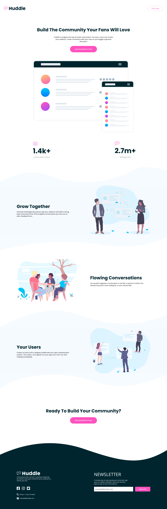

# Live Site URL: [https://master--huddle-website-veeru.netlify.app/](https://master--huddle-website-veeru.netlify.app/)

## Frontend Mentor - Huddle landing page with curved sections solution

This is a solution to the [Huddle landing page with curved sections challenge on Frontend Mentor](https://www.frontendmentor.io/challenges/huddle-landing-page-with-curved-sections-5ca5ecd01e82137ec91a50f2). Frontend Mentor challenges help you improve your coding skills by building realistic projects.

## Table of contents

- [Live Site URL: https://master--huddle-website-veeru.netlify.app/](#live-site-url-httpsmaster--huddle-website-veerunetlifyapp)
  - [Frontend Mentor - Huddle landing page with curved sections solution](#frontend-mentor---huddle-landing-page-with-curved-sections-solution)
  - [Table of contents](#table-of-contents)
  - [Overview](#overview)
    - [The challenge](#the-challenge)
    - [Screenshot](#screenshot)
    - [Links](#links)
  - [My process](#my-process)
    - [Built with](#built-with)
    - [What I learned](#what-i-learned)
  - [Author](#author)

## Overview

### The challenge

Users should be able to:

- View the optimal layout for the site depending on their device's screen size
- See hover states for all interactive elements on the page

### Screenshot

Desktop Screnshot

Mobile Screenshot

### Links

- Solution URL: [https://github.com/veeru-neerukonda/huddle-website.git](https://github.com/veeru-neerukonda/huddle-website.git)
- Live Site URL: [https://master--huddle-website-veeru.netlify.app/](https://master--huddle-website-veeru.netlify.app/)

## My process

### Built with

- Semantic HTML5 markup
- CSS custom properties
- Flexbox
- Mobile-first workflow

### What I learned

I learnt the importance of spacing in layout working on this project, I must put effort into developing tools and workflows which help me make descisions on spacing more efficiently.

## Author

- Website - [https://veeru-portfolio.netlify.app/](https://veeru-portfolio.netlify.app/)
- Frontend Mentor - [@veeru-neerukonda](https://www.frontendmentor.io/profile/veeru-neerukonda)
- Twitter - [@empyrean__sama](https://www.twitter.com/empyrean__sama)
